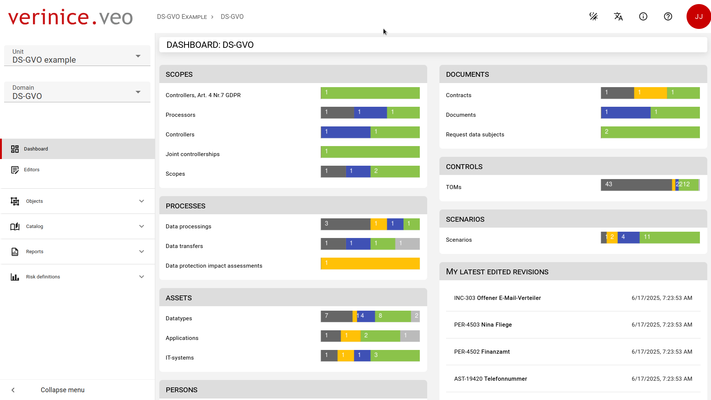

# veo-web

Welcome to the GitHub repository for the web frontend of the verinice.veo tool, the next generation solution for data protection and information security management. Leveraging modern web technologies, this software-as-a-service (SaaS) solution aims to provide a user-friendly and comprehensive approach to fulfilling data protection obligations in accordance with GDPR, ISO 27001 and other regulations. Whether you are a novice or a professional, the tool facilitates easy data collection, intuitive operation, and the generation of valuable reports, all within a web-based environment. Developed by the experienced verinice team, this frontend is part of a continuous development effort to build upon a legacy of expertise dating back to 2007 and over 10.000 customers worldwide, aiming to create a flexible, reliable, and efficient security management tool. Explore the repository to learn more about how verinice.veo is shaping the future of data protection and information security management.



## Setup

Make sure to install the dependencies:

```bash
npm install
```

## Development Server

Start the development server on http://localhost:3000

```bash
npm run dev
```

## Production

Build the application for production:

```bash
npm run build
```

Locally preview production build:

```bash
npm run preview
```

Checkout the [deployment documentation](https://v3.nuxtjs.org/guide/deploy/presets) for more information.

For detailed explanation on how things work, checkout the [Nuxt.js docs](https://github.com/nuxt/nuxt.js).

## Environment variables

| Environment variable | Default value | What does it do? |
| --- | --- | --- |
| `npm_package_version` | `latest` | Gets automatically set during build time, displays Frontend version in "About verinice." dialog. |
| `CI_COMMIT_SHORT_SHA` | `0000000` | Short Hash of commit of current build. Gets displayed in "About verinice." dialog |
| `CI_COMMIT_TIMESTAMP` | ` Date.now().toString()` | Date of current build. Gets set to current date and time when developing.Gets displayed in "About verinice." dialog |
| `CI_JOB_ID` | ` -1` | Current build ID. Gets displayed in "About verinice." dialog |
| `VEO_DEFAULT_API_URL` | `https://api.veo.example/veo` | URL of the core api. Gets used throughout the application to fetch objects, catalogs, etc.. |
| `VEO_FORMS_API_URL` | `https://api.veo.example/forms` | URL of the forms api. Gets used throughout the application to load forms that display objects. |
| `VEO_HISTORY_API_URL` | `https://api.veo.example/history` | URL of the history api. Gets used to fetch previous versions of an object |
| `VEO_REPORTING_API_URL` | `https://api.veo.example/reporting` | URL of the reports api. Gets used to generate reports. |
| `VEO_ACCOUNTS_API_URL` | `https://api.veo.example/accounts` | URL of the accounts api. Gets used to modify/create accounts apart from the client owner. |
| `VEO_OIDC_URL` | `https://auth.veo.example/auth` | URL of the OIDC provider (usually keycloak). |
| `VEO_OIDC_REALM` | `veo-oidcrealm-example` | Realm you use for veo in your OIDC provider. |
| `VEO_OIDC_CLIENT` | `veo-oidcclient-example` | Client name you use for this webapp in your OIDC provider. |
| `VEO_ACCOUNT_PATH` | `https://account.veo.example` | URL under which the user can edit his/her subscription. |
| `VEO_OIDC_ACCOUNT_APPLICATION` | `https://auth.veo.example/auth/realms/veo-oidcrealm-example/account` | URL under which the user can self manage his/her account. |
| `VEO_DEBUG` | `false` | While not exposing any critical information, this variable should only be set to true when developing. |
| `VEO_DEBUG_CACHE` | `false` | If set to true, additional logging output gets set regarding caching and retrieving of data. |
| `VEO_BETA_MODE` | `false` | If set to true, the toggle for beta mode gets enabled |
| `VEO_FEATURE_FLAG_CARD_VIEW` | `false` | If set to true, the toggle for feature flag card view gets enabled |

Required env variables (prod preset):

```
VEO_DEFAULT_API_URL=https://api.verinice.com/
VEO_FORMS_API_URL=https://api.verinice.com/forms
VEO_HISTORY_API_URL=https://api.verinice.com/history
VEO_REPORTING_API_URL=https://api.verinice.com/reporting
VEO_ACCOUNTS_API_URL=https://api.verinice.com/accounts
VEO_OIDC_URL=https://auth.verinice.com/auth
VEO_OIDC_REALM=verinice-veo
VEO_OIDC_CLIENT=veo-prod
VEO_ACCOUNT_PATH=https://account.verinice.com
VEO_OIDC_ACCOUNT_APPLICATION=https://auth.verinice.com/auth/realms/verinice-veo/account
```

## Technical debt

- All translations used by the `<i18n-t>` component are currently present in the language files and the components they get used in because of this bug: https://github.com/intlify/vue-i18n-next/issues/1248 (currently we use v8.0.0-beta, however the fix is only available for 7.3.1). The translations should get removed from the language files if the fix is also available for v8.x.
- VSkeletonLoader, VDateInput, VTimeInput, VSpeedDial, VEditDialog and VDataIterator are not yet ported to nuxt 3 (vuetify v3.1), so we currently use local polyfills. Should get replaced by the vuetify components once available as they are more feature rich, more accessible and provide a better UI/UX.
- The editors were useful to develop all object and formschemas, however constant modifications of them have left a toll on them. Should get integrated into a new, combinded editor, joining the domain editor.
- Externalize-Scripts: Currently there is no "after-everything" hook for node, so the externalize-scripts.mjx file HAS to be called after generating the application if you want to use the frontend in production (due to CSP)

## Documentation

Use the `DocsLink` component for all **internal** links instead of `<nuxt-link>`, as `<nuxt-link>` won't work in the pdf. Also remove `index` from all links in order for PDF navigation to work correctly.

## vue-query Debugging

Debugging can be enabled by setting the `VEO_DEBUG_CACHE` variable to `true` or an array containing the first part of each query key you want to debug, eg. `VEO_DEBUG_CACHE=["objects","monitoring"]`.

## License headers

Each file has to contain a license header. This project contains configuration for the VSCode Plugin [psioniq File Header](https://marketplace.visualstudio.com/items?itemName=psioniq.psi-header). If you use this plugin, the license header will get automatically generated for new files and files that don't contain a header yet. Please add your name to the license header of every file you make meaningful changes in.

## License

verinice.veo is released under GNU AFFERO GENERAL PUBLIC LICENSE Version 3 (see LICENSE.txt) and uses third party libraries that are distributed under their own terms.
