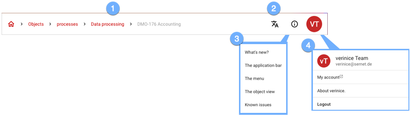

### The application bar

The application bar provides comprehensive functions for operation:

1. Use the **breadcrumb** to navigate directly to all listed objects. 1.
1. Use the **language switcher** to select the desired language from the available languages. 1.
1. The **Context Help** provides you with tutorials on the current page. 1.
1. Use the **Account** button to access further settings:
    - Switch to one of the Available **Units**.
    - Edit your user account via <a href="https://auth.verinice.com/auth/realms/verinice-veo/account">**My Account**</a>, e.g. to change the password or activate 2-factor authentication (opens in new tab).
    - **About verinice** opens a dialogue with more detailed information about the runtime environment.
    - End the active session via **Logout**.
