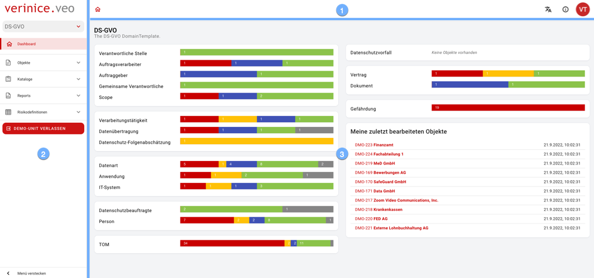

## Die Benutzeroberfläche

Die Benutzeroberfläche besteht aus den Bereichen:

|||
|---|---|
||<ol><li>Die <DocLink to="/1_manual/1_user-interface/app_bar">**Anwendungsleiste**</DocLink> stellt übergreifende Funktionen zur Bedienung bereit.</li><li>Über das <DocLink to="/1_manual/1_user-interface/menu">**Menü**</DocLink> navigieren Sie durch sämtliche Inhalte.</li><li>Die <DocLink to="/1_manual/1_user-interface/workbench">**Arbeitsfläche**</DocLink> stellt Inhalte in unterschiedlichen Ansichten zur Verfügung.</li></ol>
|
