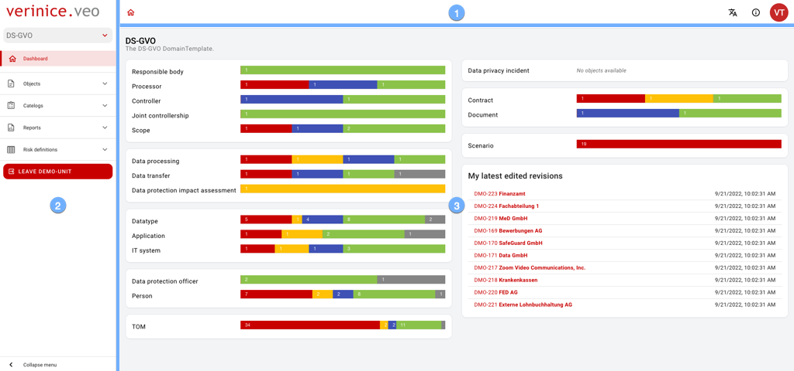

## The user interface

The user interface consists of the areas:

|||
|---|---|
||<ol><li>The <DocLink to="/1_manual/1_user-interface/app_bar">**app bar**</DocLink> provides overarching functions for operation. </li><li>Using the <DocLink to="/1_manual/1_user-interface/menu">**menu**</DocLink> you navigate through all content.</li><li>The <DocLink to="/1_manual/1_user-interface/workbench">**workspace**</DocLink> provides content in different views.</li></ol>
|
