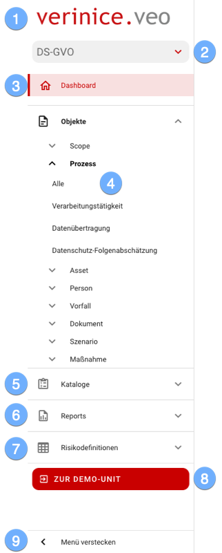

### Das Menü
Über das Menü navigieren Sie komfortabel durch verinice:

|||
|---|---|
|| <ol><li>Über das **Logo** gelangen Sie jederzeit auf die Startseite (momentan zum Dashboard der aktiven Unit).</li><li>Wählen Sie aus den verfügbaren <DocLink to="???">**Domänen**</DocLink> die gewünschte aus. Initial steht die Domäne *Datenschutz nach DS-GVO* bereit, weitere Domänen werden sukzessive bereitgestellt.</li><li>Auf dem <DocLink to="???">**Dashboard**</DocLink> erhalten Sie einen Überblick über alle Objekte und deren Status (Lebenszyklus).</li><li>Im Bereich <DocLink to="???">**Objekte**</DocLink> navigieren Sie zu allen vorhandenen *Objekttypen* und *Subtypen*.</li><li>In <DocLink to="???">**Kataloge**</DocLink> stehen Ihnen Objekte wie z.B. *TOM* oder *Datenschutzgefährdungen* zur Verfügung.</li><li>Wählen Sie eine der verfügbaren Reportvorlagen zum Ausdruck im Abschnitt <DocLink to="???">**Reports**</DocLink>.</li><li>Die Parameter für die Risikoanalyse werden im Abschnitt <DocLink to="???">**Risikodefinitionen**</DocLink> graphisch dargestellt.</li><li>Die <DocLink to="???">**Demo-Unit**</DocLink> stellt Beispieldaten zum Testen aller Funktionen bereit. Sie wird täglich zurückgesetzt und alle persönlichen Änderungen werden gelöscht. ***Die Demo-Unit kann nicht für den produktiven Einsatz verwendet werden!***</li><li>Um die Arbeitsfläche zu vergrößern, reduzieren Sie das Menü über **Menü verstecken** auf Symbole. Das Menü wird durch Mausklick auf die Symbole automatisch wieder eingeblendet.</li></ol>|
