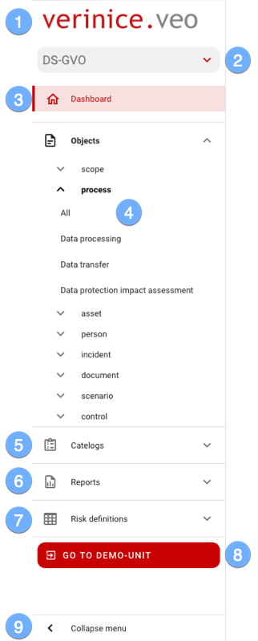

### The menu
Use the menu to navigate comfortably through verinice:

|||
|---|---|
|| <ol><li>The **logo** will take you to the start page at any time (currently to the dashboard of the active unit).</li><li>Select from the available <DocLink to="? ??">**Domains**</DocLink> the desired one. Initially, the domain *Data protection according to DS-GVO* is ready, further domains will be provided successively.</li><li>On the <DocLink to="? ??">**Dashboard**</DocLink> you get an overview of all objects and their status (life cycle).</li><li>In the <DocLink to="??">**Objects**</DocLink> area you navigate to all existing *object types* and *subtypes*.</li><li>In <DocLink to="??">**Catalogues**</DocLink> objects such as *TOM* or *Data protection risks* are available to you. </li><li>Select one of the available report templates for printing in the <DocLink to="??">**Reports**</DocLink> section.</li><li>The parameters for the risk analysis are graphically displayed in the <DocLink to="??">**Risk Definitions**</DocLink> section.</li><li>The <DocLink to="??">**Demo Unit**</DocLink> provides sample data for testing all functions.  It is reset daily and all personal changes are deleted. ***The demo unit cannot be used for productive use!***</li><li>To increase the working area, reduce the menu via **Hide menu** to icons. The menu is automatically displayed again by clicking on the icons with the mouse.</li></ol>|
