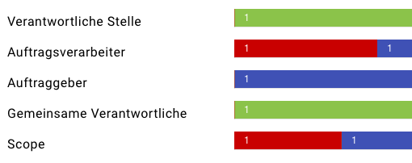
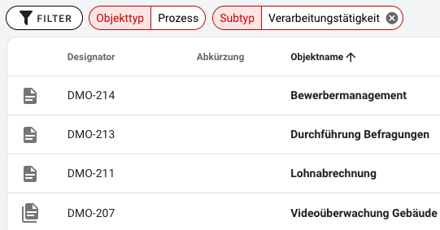
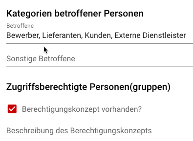
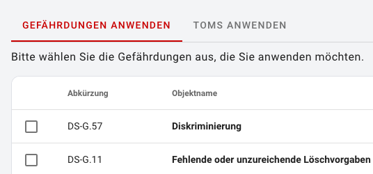
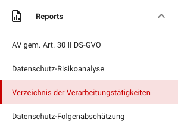
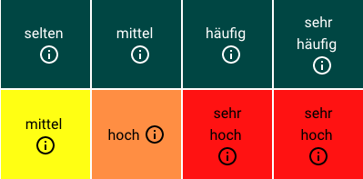

## Die Arbeitsfläche

Die Arbeitsfläche stellt je nach Kontext verschiedenste Inhalte dar.

||||
|:---:|:---:|:---:|
|<DocLink to="/1_manual/2_dashboard/index">**Dashboard**</DocLink>|<DocLink to="/1_manual/3_objects/object-list">**Objektübersicht**</DocLink>|<DocLink to="/1_manual/3_objects/object-details">**Objektdetails**</DocLink>|
||||
|<DocLink to="/1_manual/4_catalogues/index">**Kataloge**</DocLink>|<DocLink to="/1_manual/5_reports/index">**Reports**</DocLink>|<DocLink to="/1_manual/6_risk-definition/index">**Risikodefinitionen**</DocLink>|
||||
