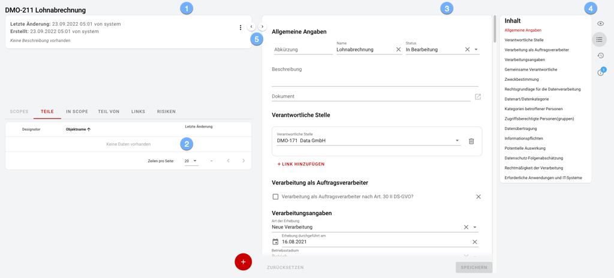
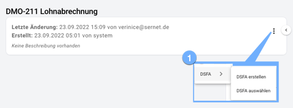
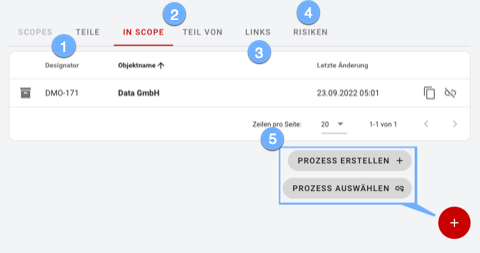

#### Objektdetails

Die Detailansicht eines Objektes gliedert Informationen zum Objekt in vier Bereiche:

1. Die Objektbeschreibung.
1. Eine Tabelle mit allen Objekten im Umfeld.
1. Das Formular mit allen Detailangaben.
1. Die optional einblendbare Seitenleiste.
1. Um je nach Aufgabenstellung die Arbeitsfläche optimal auszunutzen blenden Sie die beiden Spalten mittels Button oder Tatstaur aus PC: linke Spalte **Alt+1** / rechte Spalte **Alt+2** Mac: linke Spalte **Control+2** / rechte Spalte **Control+2**

##### Die Objektbeschreibung

Die Objektbeschreibung gibt einen ersten schnellen Überblick über das aktuelle Objekt:

1. Über das *Hamburger-Menü* wählen Sie spezifische Aktionen für das aktuelle Objekt aus.

##### Das Objektumfeld

Das Objektumfeld kann je nach Objekttyp aus **Scopes**, **Teilen**, **Links** und **Risiken** bestehen. 
Wichtig ist dabei die Unterscheidung von **Scope**-Objekten und **Composite**-Objekten im neuen Objektmodell: 
* **Scopes** können beliebige **Composite**-Objekte UND **Scope**-Objekte enthalten. Jedes **Scope**-Objekt und jedes **Composite**-Objekt kann zudem in verschiedenen **Scopes** enthalten sein!
* **Composite**-Objekte können hingegen nur Objekte des SELBEN **Objekttyps** enthalten. Anders als eine Gruppe hat das **Composite**-Objekt die gleichen Eigenschaften wie ein einzelnes Objekt des jeweiligen Objekttyps.

Die Darstellung des Objektumfeldes zeigt dabei:
1. Mit **Scopes** und **Teile** den Blick *nach innen*.
1. Mit **In Scope** und **Teil von** den Blick *nach außen*.
1. Mit **Links** aus dem Formular heraus verknüpfte Objekte.
1. Mit **Risiken** wo vorhanden die betrachteten Gefährdungen und deren Behandlung.
1. Je nach aktivem **Tabellenreiter** können kontextsensitiv Elemente hinzugefügt werden. Elemente die neinem Objekt nicht zur Verfügung stehen sind ausgegraut.

