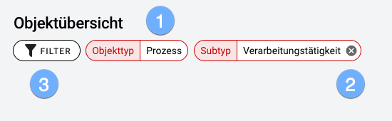
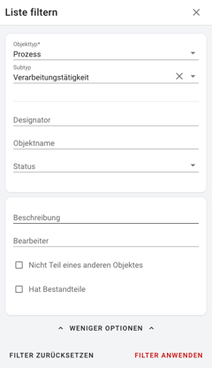
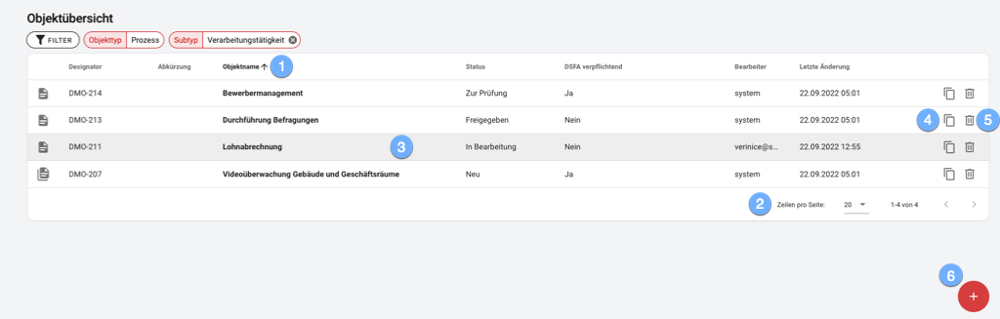

#### Objektübersicht

Die Navigation über das Menü oder das Dashboard öffnet die **Objektübersicht**, die immer eine **gefilterte Liste** von Objekten angezeigt.

Die aktiven Filterkriterien werden über der Objektliste dargestellt:

1. Als Mindestkriterium ist immer der **Objekttyp** erforderlich!
1. Durch Löschen **optionaler Filterkriterien** erweitern Sie die Objektliste direkt.
1. Für die Filterung nach weiteren Kriterien öffnen Sie den **Filterdialog**:

1. Sortieren Sie die Objektliste nach den wichtigsten Spalten auf- oder absteigend.
1. Je nach Anzahl der Objekte in der Liste navigieren Sie durch zusätzliche Seiten oder erweitern die Anzahl der je Seite dargestellten Objekte.
1. Öffnen Sie ein Objekt zur Bearbeitung durch Mausklick auf die Zeile.
1. Duplizieren Sie Objekte um ein gleichartiges Objekt aus einer Kopie heraus zu erstellen.
1. Nicht mehr benötigte Objekte **löschen** Sie nach Bestätigung einer Sicherheitsabfrage.
1. Erstellen Sie ein neues Objekt mit Objekttyp und Subtyp der aktuellen Filterkriterien.

