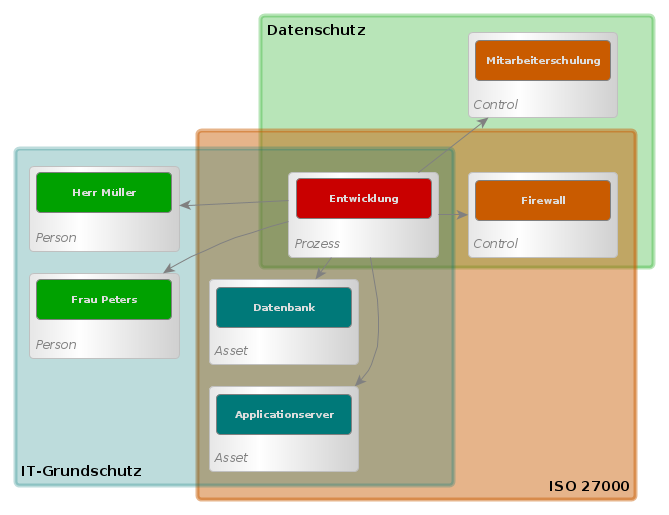

# Vorwort

Hallo Team

`Model once, manage all`

verinice.veo ist nicht nur eine Anwendung für den Aufbau und Betrieb eines Information Security Management System (ISMS), es ist Platform und Baukasten für das Verwalten verschiedener Standards. In diesem Baukasten kann jeder Standard für die eigenen Zwecke angepasst werden und veo erlaubt es, auf Basis vorhandener Standards neue Vorgehen zu beschreiben und zu verwalten. Alle Informationen werden dabei in einem universell verwendbaren Modell gespeichert. veo speichert alle Daten in einem Modell, egal welche Norm oder Vorgehensweise zur Anwendung kommt.

Dieses Dokument beschreibt die technischen Grundlagen von verinice.veo für Anwenderinnen und Anwendern, die die Anwendung nicht nur benutzen wollen, sondern auch verstehen wollen wie sie funktioniert und daran interessiert sind, veo für ihre Zwecke zu optimieren und anzupassen. Natürlich ist die technische Dokumentation auch für Entwicklerinnen und Entwickler bestimmt, die veo weiterentwickeln oder an Schnittstellen zu dieser Anwendung arbeiten.

Dieses Dokument ist kein Handbuch oder Tutorial, das Anwenderinnen und Anwendern dabei hilft den Einstieg in die Benutzung der Anwendung zu finden. Es enthält keine theoretische Grundlagen für den Aufbau und Betrieb ISMS oder über die Datenschutz-Grundverordnung (DS-GVO).
