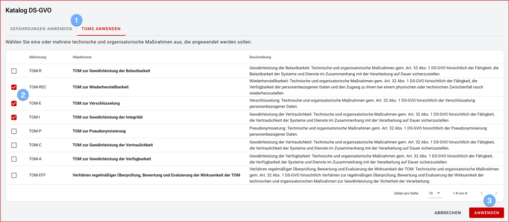

## Kataloge

 

1. In Katalogen stehen je nach Domäne global Objekte zur Anwendung in Ihrer Installation zur Verfügung.  Dies können z.B. Datenschutzgefährdungen, TOM oder IT-Grundschutz-Bausteine sein.
1. Wählen Sie die gewünschten Objekte aus.
1. Beim Anwenden werden die gewählten Objekte in Ihre jeweilige Unit kopiert und können dort verwendet werden.
