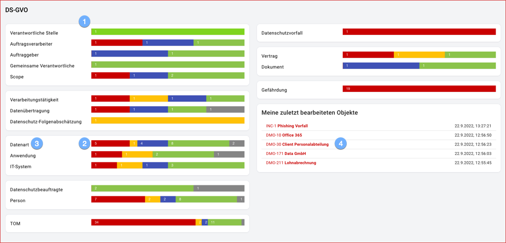

 

Auf dem Dashboard werden alle Objekte und deren Status (Lebenszyklus) graphisch dargestellt und durch Mausklick navigieren Sie direkt zu den jeweiligen Objekten.

1. Die Objekte sind gruppiert nach den **Objekttypen** (Scopes, Prozesse, Assets, Personen, Controls, Vorfälle, Dokumente und Szenarien) und den jeweiligen **Subtypen**, z.B. Verantwortliche Stelle, Auftragsverarbeiter, Auftraggeber, Gemeinsame Verantwortliche und Scope (allgemein) für den Objekttyp Scope.
1. Die **Status** (Lebenszyklus) sind farbig codiert: Rot = Neu, Gelb = In Bearbeitung, Blau = Zur Prüfung, Grün = Freigegeben, Grau = Archiviert
1. Durch Mausklick auf z.B. den **roten Balken bei Datenart** gelangen Sie zur Objektübersicht aller **Asset**-Objekte des Subtyp **Datenart** mit Status **neu**. Durch Mausklick auf die Bezeichnung **Datenart** gelangen Sie analog zur Objektübersicht aller **Asset**-Objekte ohne Einschränkung des Subtyps oder des Status.
1. Im Abschnitt **Meine zuletzt bearbeiteten Objekte** können Sie diese durch Mausklick direkt zur weiteren Bearbeitung aufrufen.

 
