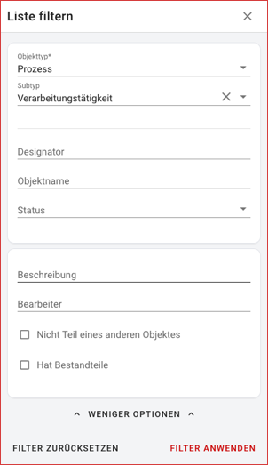
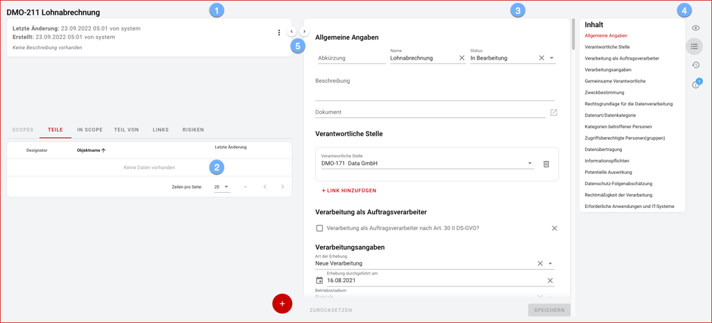
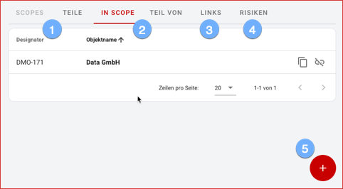
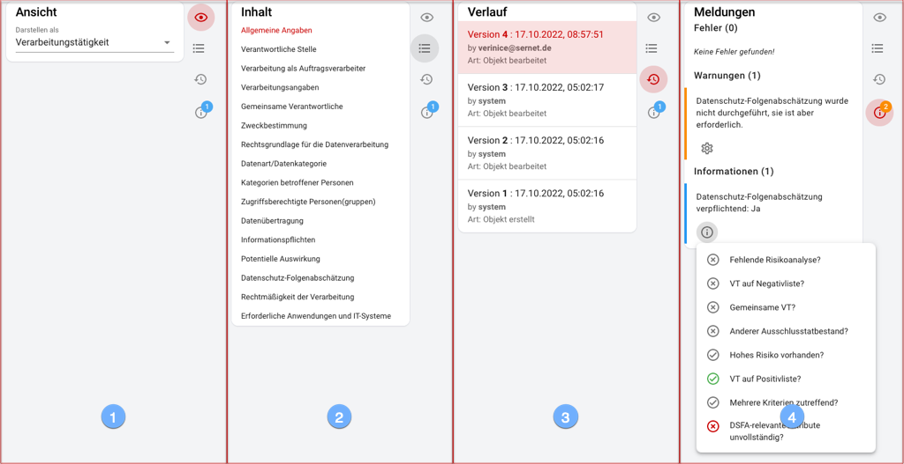

### Objekte

 

Im Abschnitt Objekte können Objekte angelegt, bearbeitet oder gelöscht werden.

#### Objektübersicht

 

Die Navigation über das Menü oder das Dashboard öffnet die **Objektübersicht**, die immer eine **gefilterte Liste** von Objekten angezeigt.

Die aktiven Filterkriterien werden über der Objektliste dargestellt:

1. Als Mindestkriterium ist immer der **Objekttyp** erforderlich!
1. Durch Löschen **optionaler Filterkriterien** erweitern Sie die Objektliste direkt.
1. Für die Filterung nach weiteren Kriterien öffnen Sie den **Filterdialog**:

 

Die Objektübersicht dient der schnellen Orientierung und Navigation innerhalb der Liste:

1. Sortieren Sie die Objektliste nach den wichtigsten Spalten auf- oder absteigend.
1. Je nach Anzahl der Objekte in der Liste navigieren Sie durch zusätzliche Seiten oder erweitern die Anzahl der je Seite dargestellten Objekte.
1. Öffnen Sie ein Objekt zur Bearbeitung durch Mausklick auf die hervorgehobene Zeile.
1. Duplizieren Sie Objekte um ein gleichartiges Objekt aus einer Kopie heraus zu erstellen.
1. Nicht mehr benötigte Objekte **löschen** Sie nach Bestätigung einer Sicherheitsabfrage.
1. Erstellen Sie ein neues Objekt mit Objekttyp und Subtyp entsprechend der aktuellen Filterkriterien.

 

#### Objektdetails

 

Die Detailansicht eines Objektes gliedert Informationen zum Objekt in vier Bereiche:

1. Die Objektbeschreibung.
1. Eine Tabelle mit allen Objekten im Umfeld.
1. Das Formular mit allen Detailangaben.
1. Die optional einblendbare Seitenleiste.
1. Um je nach Aufgabenstellung die Arbeitsfläche optimal auszunutzen blenden Sie die beiden Spalten mittels Button oder Tatstaur aus PC: linke Spalte **Alt+1** / rechte Spalte **Alt+2** Mac: linke Spalte **Control+2** / rechte Spalte **Control+2**

 

##### Objektbeschreibung

 

Die Objektbeschreibung gibt einen ersten schnellen Überblick über das aktuelle Objekt:

1. Über das *Hamburger-Menü* wählen Sie spezifische Aktionen für das aktuelle Objekt aus.

 

##### Objektumfeld

 

Das Objektumfeld kann je nach Objekttyp aus **Scopes**, **Teilen**, **Links** und **Risiken** bestehen. 
Wichtig ist dabei die Unterscheidung von **Scope**-Objekten und **Composite**-Objekten im neuen Objektmodell: 
* **Scopes** können beliebige **Composite**-Objekte UND **Scope**-Objekte enthalten. Jedes **Scope**-Objekt und jedes **Composite**-Objekt kann zudem in verschiedenen **Scopes** enthalten sein!
* **Composite**-Objekte können hingegen nur Objekte des SELBEN **Objekttyps** enthalten. Anders als eine Gruppe hat das **Composite**-Objekt die gleichen Eigenschaften wie ein einzelnes Objekt des jeweiligen Objekttyps.

 

Die Darstellung des Objektumfeldes zeigt dabei:

1. Mit **Scopes** und **Teile** den Blick *nach innen*.
1. Mit **In Scope** und **Teil von** den Blick *nach außen*.
1. Mit **Links** aus dem Formular heraus verknüpfte Objekte.
1. Mit **Risiken** wo vorhanden die betrachteten Gefährdungen und deren Behandlung.
1. Je nach aktivem **Tabellenreiter** können kontextsensitiv Elemente hinzugefügt werden. Stehen Elemente für ein Objekt nicht zur Verfügung, sind die **Tabellenreiter** ausgegraut.

 

##### Formulare

 

Formulare ermöglichen die strukturierte Erfassung von (fachlichen) Inhalten, es wird unterschieden zwischen:

- **Aspekten**, einer Gruppierung zusammengehöriger Daten und
- **Links**, der Verknüpfung zu anderen Objekten inklusive spezifischer Daten für die jeweilige Verknüpfung.

 

(Das Objektmodell sieht **Custom Aspects** und **Custom Links** vor, die in späteren Erweiterungen *kundenspezifisch* angepasst werden können.)

Die strukturierte Erfassung wird unterstützt durch die intelligente Auswertung eingegebener Daten:

- In Abhängigkeit einzelner Werte können unterschiedliche Aspekte oder Links eingeblendet werden.
- Komplexe Entscheidungen auf Grundlage unterschiedlicher Werte können in Entscheidungsbäumen ausgewertet werden, siehe z.B. die Entscheidung zur Notwendigkeit einer Datenschutz-Folgenabschätzung.

 

Jeder Subtyp eines bestimmten Objekttyps muss in mindestens einem spezifischen Formular dargestellt werden. Anders herum kann jeder Subtyp kann aber auch in verschiedenen Formularen abgebildet werden.
Dadurch könnte z.B. der Subtyp **Verarbeitungstätigkeit** in einem **einfachen** Erfassungsformular für den Prozessverantwortlichen erfasst werden, während etwa der Rolle Datenschutzbeauftragte ein **ausführliches** Formular mit tiefergehenden Angaben zur Verfügung steht.

 

##### Seitenleiste

In der Seitenleiste können durch Mausklick auf eines der Symbole weitere Informationen zu einem Formular eingeblendet werden:

1. In der Seitenleiste **Ansicht** können Objekte je nach Subtyp in einem anderen Formular angezeigt werden.
1. Formularinhalte werden in der Seitenleiste **Inhalt** strukturiert dargestellt. Durch Mausklick kann zu den einzelnen Abschnitten navigiert werden.
1. Die Seitenleiste **Verlauf** listet alle Änderungen an einem Objekt in **Versionen** auf. Der Umgang mit Versionen ist im folgenden Abschnitt beschrieben.
1. Fehler, Warnungen oder Informationen zu aktuellen Formulareingaben werden in der Seitenleiste **Meldungen** dargestellt.

 

#### Versionierung

verinice.veo speichert jede Änderung an Objekten auf Feldebene als Version und stellt damit einen kompletten **Audit-Trail** bereit.

In der Seitenleiste **Verlauf** werden alle früheren Versionen aufgelistet, durch Anklicken einer Version wird diese angezeigt. Über die Schaltfläche **Wiederherstellen** kann zu jeder früheren Version zurückgekehrt werden (**Undo-Funktion**).

 

