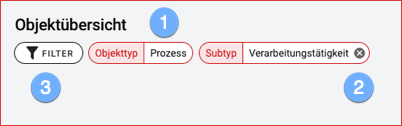
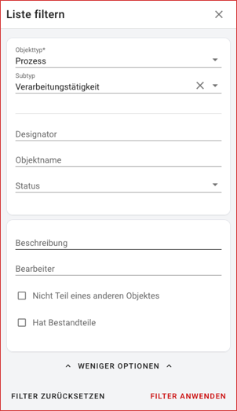
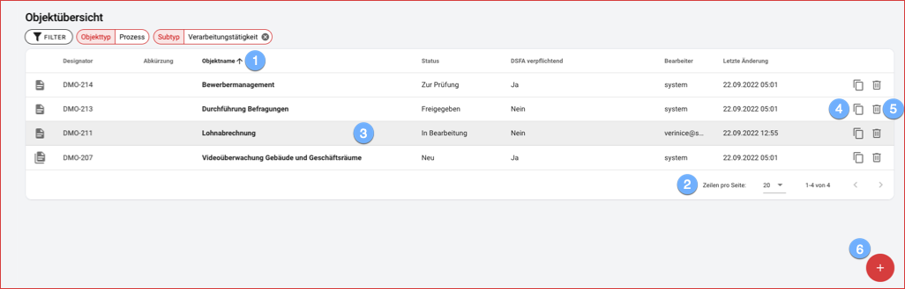
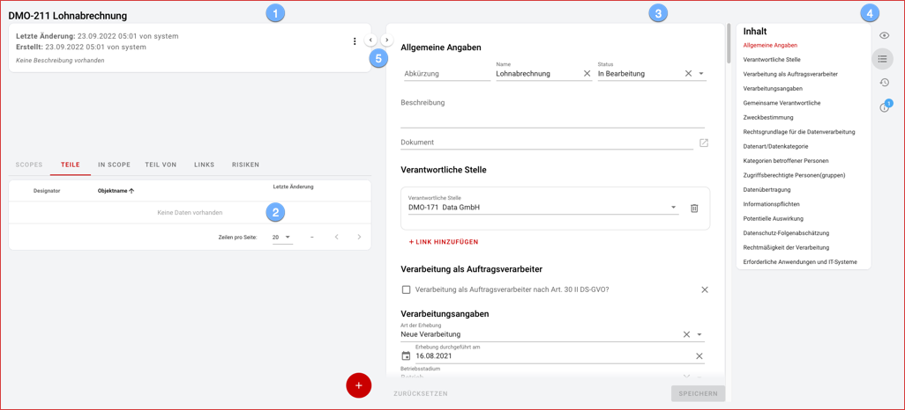
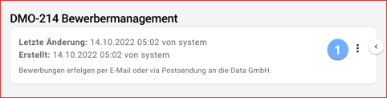
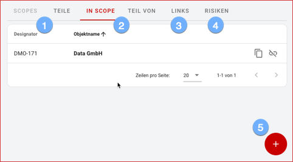
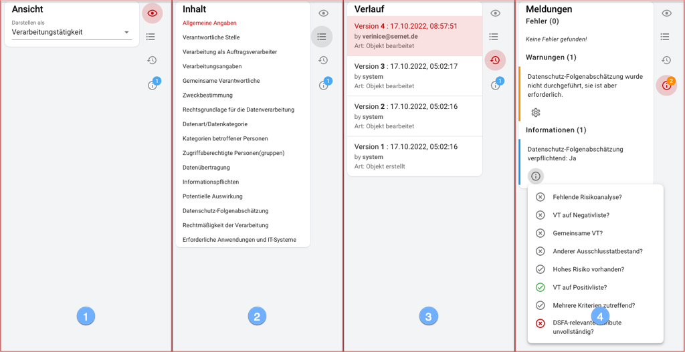

In the Objects section, objects can be created, edited or deleted.

#### Object overview

 

Navigating via the menu or dashboard opens the **Object Overview**, which always displays a **filtered list** of objects.

The active filter criteria are displayed above the object list:

1. **Object type** is always required as minimum criterion!
1. by deleting **optional filter criteria** you extend the object list directly.
1. for filtering by further criteria open the **filter dialog**:

 

The object overview is used for quick orientation and navigation within the list:

1. sort the object list by the most important columns in ascending or descending order.
1. depending on the number of objects in the list, navigate through additional pages or expand the number of objects displayed per page.
1. open an object for editing by mouse click on the highlighted line.
1. duplicate objects to create a similar object from a copy.
1. objects that are no longer needed **delete** after confirming a security prompt.
1. create a new object with object type and subtype according to the current filter criteria.

 

#### Object details

 

The detail view of an object divides information about the object into four areas:

1. the object description.
1. a table with all objects in the environment.
1. the form with all details.
1. the optional sidebar.
1. in order to use the work surface optimally depending on the task hide the two columns by means of Button or keyboard PC: left column **Alt+1** / right column **Alt+2** Mac: left column **Control+2** / right column **Control+2**.

 

##### Object description

 

The object description gives a first quick overview of the current object:

1. use the *object menu* to select specific actions for the current object.

 

##### Object environment

 

Depending on the object type, the object environment can consist of **Scopes**, **Parts**, **Links** and **Risks**. 
It is important to distinguish between **Scope** objects and **Composite** objects in the new object model: 
* **Scopes** can contain any **Composite** objects AND **Scope** objects. In addition, each **Scope** object and each **Composite** object can be contained in different **Scopes**!
* **Composite** objects, on the other hand, can only contain objects of the SAME **object type**. Other than a group, the **Composite** object has the same properties as a single object of the respective object type.

 

The representation of the object environment shows thereby:

1. with **Scopes** and **Parts** the view *inward*.
1. with **In Scope** and **Part of** the view *outward*.
1. with **Links** linked objects out of the form.
1. with **Risks** where available the considered hazards and their treatment.
1. Depending on the active **table tab**, elements can be added context-sensitively. If elements are not available for an object, the **table tabs** are grayed out.

 

##### Forms

 

Forms allow the structured entry of (technical) content, a distinction is made between:

- **Aspects**, a grouping of related data and.
- **Links**, the link to other objects including specific data for the respective link.

 

(The object model provides **Custom Aspects** and **Custom Links**, which can be *customized* in later extensions).

Structured entry is supported by intelligent evaluation of entered data:

- Depending on individual values, different aspects or links can be displayed.
- Complex decisions based on different values can be evaluated in decision trees, see e.g. the decision on the necessity of a data protection impact assessment.

 

Each subtype of a given object type must be represented in at least one specific form. However, the other way around, each subtype can be represented in different forms.
This would allow, for example, the **processing activity** subtype to be captured in a **simple** data entry form for the process owner, while, for example, the data protection officer role would have a **extensive** form with more in-depth information.

 

##### Sidebar

In the sidebar, further information about a form can be displayed by clicking on one of the icons:

1. objects can be displayed in the sidebar **View** in a different form depending on the subtype.
1. form contents are displayed structured in the sidebar **contents**. You can navigate to the individual sections by clicking on them with the mouse.
1. the sidebar **History** lists all changes to an object in **Versions**. The handling of versions is described in the following section.
1. errors, warnings or information about current form inputs are displayed in the **Messages** sidebar.

 

#### Versioning

verinice.veo stores every change to objects on field level as a version and thus provides a complete **audit trail**.

In the sidebar **History** all previous versions are listed, by clicking on a version it will be displayed. The **Restore** button can be used to return to any previous version (**Undo function**).

 

