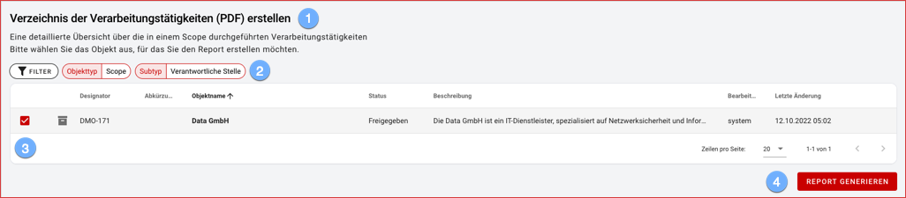

## Reports

 

Im Abschnitt Reports wählen Sie aus den zur Verfügung stehenden Vorlagen die gewünschte aus:

1. Für jede Vorlage wird eine kurze Beschreibung des Inhalts angezeigt.
1. Reports werden im Normalfall Scope-übergreifend erstellt.  Je nach Art des Berichtes kann ein bestimmter Subtyp gefordert sein!
1. Bei Auswahl des gewünschten Scopes in der Objektliste stehen die aus der Objektübersicht bekannten Filter- und Sortieroptionen zur Verfügung.
1. Der PDF-Report wird generiert und standardmäßig in Ihrem Download-Ordner gespeichert sowie in einem neuen Browser-Tab geöffnet.
