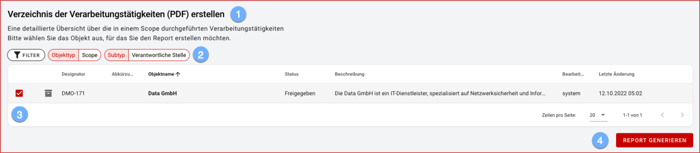

In the Reports section, select the desired template from those available:

1. for each template a short description of the content is displayed.
1. reports are normally created across scopes.  Depending on the type of report, a specific subtype may be required!
1. when selecting the desired scope in the object list, the filter and sort options known from the object overview are available.
1. the PDF report is generated and saved by default in your download folder and opened in a new browser tab.
