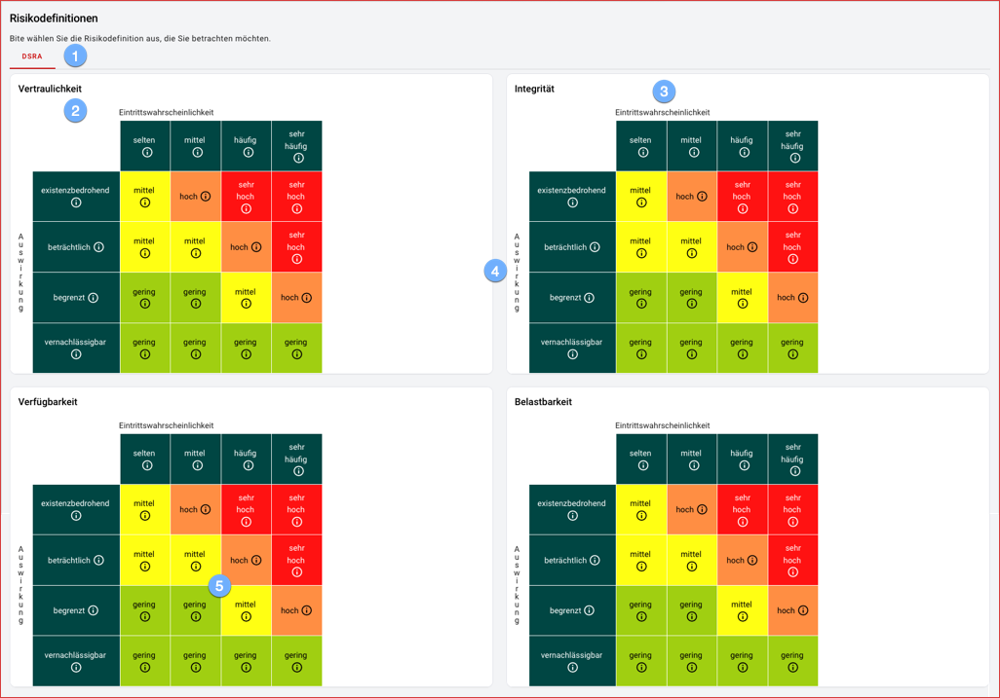

In the section risk definitions the definitions for the risk analysis can be seen:

1. there can be different risk definitions.
1. for each protection goal (here confidentiality, integrity, availability and resilience), a probability of occurrence-impact matrix is shown.
1. The X-axis shows the levels for the probability of occurrence.
1. The Y-axis shows the levels for the impact.
1. The matrix shows the assignment of risk categories (low, medium, high, very high) color coded.  Hover the mouse over the info icon to see the detailed definitions for each parameter.

 
