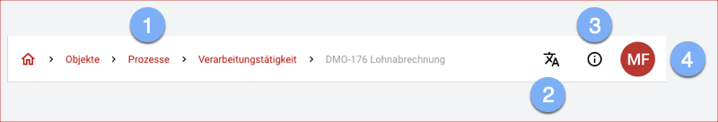

Die Anwendungsleiste stellt übergreifende Funktionen zur Bedienung bereit:

1. Über die **Breadcrumb** navigieren Sie direkt zu allen aufgeführten Objekten.
1. Mit dem **Sprachumschalter** wählen Sie aus den verfügbaren Sprache die gewünschte aus.
1. Die **Kontext-Hilfe** stellt Ihnen Tutorials zur aktuellen Seite zur Verfügung.
1. Über die Schaltfläche **Account** gelangen Sie zu weiteren Einstellungen:
    - Wechseln Sie zu einer der Verfügbaren **Units**.
    - Ihr Benutzerkonto bearbeiten Sie über <a href="https://auth.verinice.com/auth/realms/verinice-veo/account">**Mein Konto**</a>, um z.B. das Passwort zu ändern oder eine 2-Faktor-Authentifizierung zu aktivieren (öffnet in neuem Tab).
    - **Über verinice** öffnet einen Dialog mit tiefergehenden Informationen zur Laufzeitumgebung.
    - Beenden Sie die aktive Session über **Abmelden**.

 
