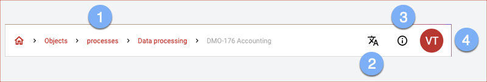

The application bar provides overarching functions for operation:

1. use the **breadcrumb** to navigate directly to all listed objects.
1. with the **language switcher** you select the desired language from the available ones.
1. **Context Help** provides you with tutorials on the current page.
1. **Account** button will take you to more settings:
    - Switch to one of the Available **Units**.
    - Edit your user account via <DocLink to="??">My Account</DocLink>, e.g. to change the password or to activate 2-factor authentication (opens in new tab).
    - **About verinice** opens a dialog with more detailed information about the runtime environment.
    - End the active session via **Logout**.

 
