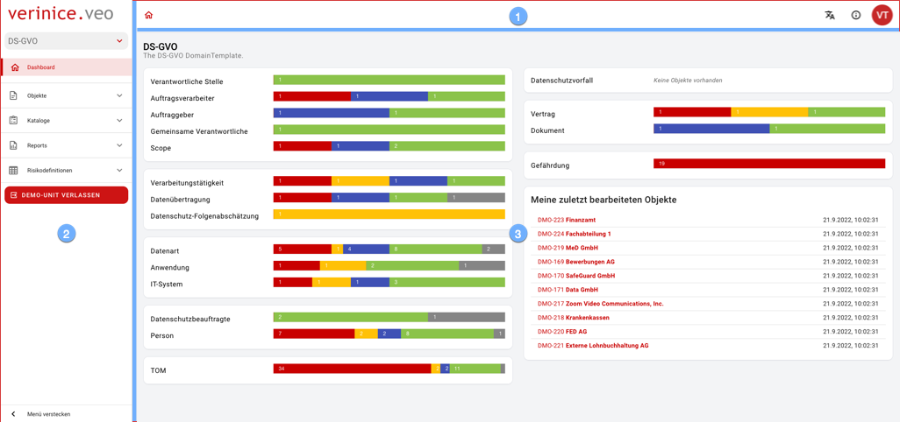

## Benutzeroberfläche

 

Die Benutzeroberfläche besteht aus drei Bereichen:

1. Die <DocLink to="/manual/user-interface/app_bar">Anwendungsleiste</DocLink> stellt übergreifende Funktionen zur Bedienung bereit.
1. Über das <DocLink to="/manual/user-interface/menu">Menü</DocLink> navigieren Sie durch sämtliche Inhalte.
1. Die <DocLink to="/manual/user-interface/workbench">Arbeitsfläche</DocLink> stellt Inhalte in unterschiedlichen Ansichten zur Verfügung.

 

 
