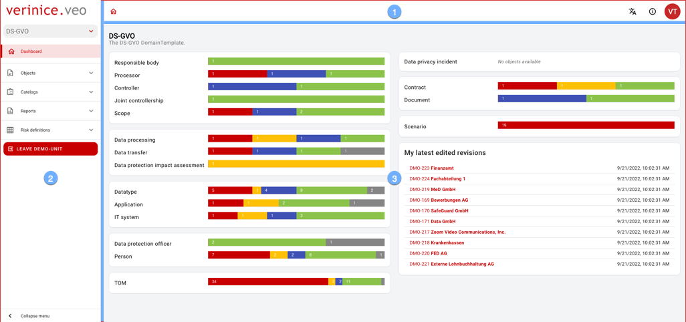

The user interface consists of three areas:

1. the <DocLink to="/manual/user-interface/app_bar">app bar</DocLink> provides overarching functions for operation.
1. the <DocLink to="/manual/user-interface/menu">menu</DocLink> navigates through all content.
1. the <DocLink to="/manual/user-interface/workbench">workbench</DocLink> provides content in different views.

 

 
