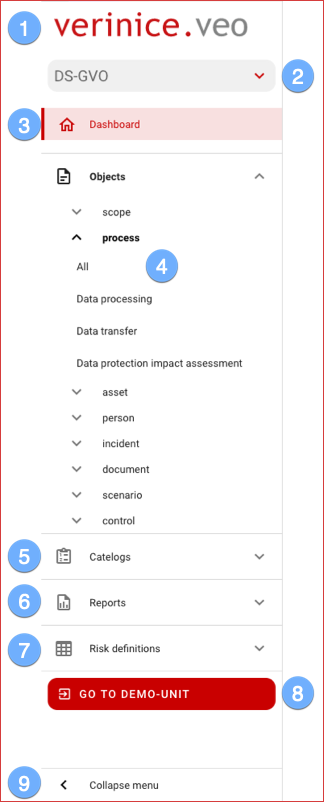

### menu

 

Use the menu to navigate comfortably through verinice:

|||
|---|---|
|| <ol><li>Use the logo to get to the home page at any time (currently to the dashboard of the active unit).</li><li>Select from the available <DocLink to="/domains/index">domains</DocLink> the desired one. Initially, the domain Data Protection according to DS-GVO is ready, other domains will be provided successively. </li><li>On the <DocLink to="/manual/dashboard/index">Dashboard</DocLink> you get an overview of all objects and their status (life cycle). </li><li>In the <DocLink to="/manual/objects/index">Objects</DocLink> section you navigate to all existing object types and subtypes.</li><li>In <DocLink to="/manual/catalogues/index">Catalogues</DocLink> you have objects like. TOM or privacy threats.</li><li>Select one of the available report templates for printing in the <DocLink to="/manual/reports/index">Reports</DocLink> section.</li><li>The risk analysis parameters are graphically displayed in the <DocLink to="/manual/risk-definition/index">Risk definitions</DocLink> section.</li><li>The **Demo Unit** provides sample data for testing all functions.  It is reset daily and all personal changes are deleted. **The Demo-Unit cannot be used for productive use!**</li><li>To increase the workspace, you can hide the **menu** (shrink it to icons). The menu is automatically shown again by clicking on the icons with the mouse.</li></ol>|

 
