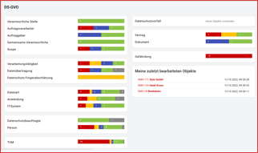
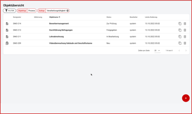
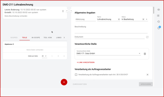
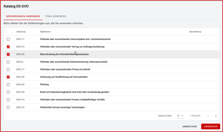
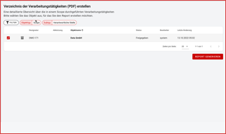
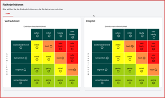

## Arbeitsfläche

 

Die Arbeitsfläche stellt je nach Kontext verschiedenste Inhalte dar:

||||
|:---:|:---:|:---:|
|<DocLink to="/manual/dashboard/index">Dashboard  </DocLink>     .     |<DocLink to="/manual/objects/index#objektübersicht">Objektübersicht  </DocLink>     .     |<DocLink to="/manual/objects/index#objektdetails">Objektdetails  </DocLink>|
| | | |
|<DocLink to="/manual/catalogues/index">Kataloge  </DocLink>     .     |<DocLink to="/manual/reports/index">Reports  </DocLink>     .     |<DocLink to="/manual/risk-definition/index">Die Risikodefinitionen  </DocLink>|

 
