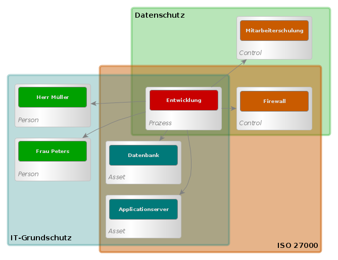
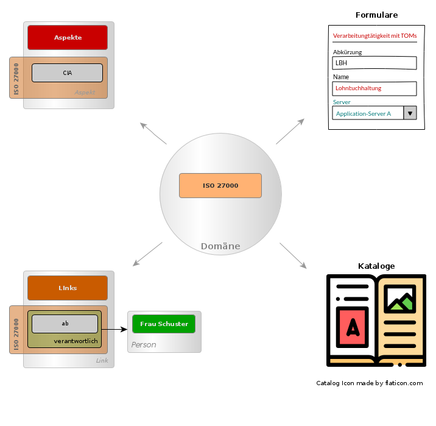
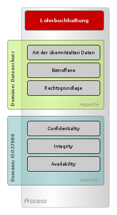
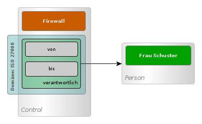

### Domänen

Die verschiedenen Fachbereiche, die mit dem Manangementsystem veo bearbeitet werden können, werden *Domänen* genannt. Im Moment ist geplant, das 3 Domänen in veo enthalten sein werden:

* Datenschutz
* IT-Grundschutz
* ISO 27000

Diese 3 Domänen können einzeln benutzt oder kombiniert werden. Anwenderinnen und Anwender können zuerst mit der Domäne Datenschutz beginnen und dort zum Beispiel ein Verzeichnis der Verarbeitungstätigkeiten erstellen.
Später ist es möglich dieselben Objekte, die dafür erstellt wurden, auch in der Domäne IT-Grundschutz zu verwenden. Domäne können aber auch kopiert und erweitert werden. Es können eigene Domänen erzeugt werden, die ggf. aus den vorhandenen abgeleitet werden.

Eine Domäne besteht aus einer Menge von Aspekten, Links, Formularen und Katalogen:

* Ein Fachobjekt enthält mehrere Gruppen von Eigenschaften (Properties). Diese Gruppen werden im Objektmodell von veo **Aspekte** genannt. Ein Aspekt ist einer oder mehrerer Domänen zugeordnet.
* **Links** sind Verknüpfungen eines Objekts zu einem anderen Objekt. Genau wie Aspekte können Links Eigenschaften enthalten, die diese Verknüpfung beschreiben.
* Mit einem **Formular** können genau die Daten erfasst werden, die für einen bestimmten Anwendungsfall (Use Case) aus einer Domäne benötigt werden.
* Ein **Katalog** ist eine Sammlung von Fachobjekten mit Aspekten aus der Domäne, die auf ein ISMS-Modell angewendet werden können.

#### Aspekte

Ein Aspekt enthält mehrere Eigenschaften eines Fachobjekts. Jeder Aspekt ist einer oder mehrerer Domänen zugeordnet. Zusammengenommen bilden alle Aspekte die verschiedenen Blickwinkel auf ein Fachobjekt ab.

Ein Prozess kann zum Beispiel in der Domäne Datenschutz ein Verfahren für ein Verzeichnis der Verarbeitungstätigkeiten sein. Daher enthält der Prozess Aspekte mit Eigenschaften aus der Domäne Datenschutz für das Verzeichnis der Verarbeitungstätigkeiten. Gleichzeitig kann derselbe Prozess aber auch Teil einer Risikoanalyse in der Domäne ISO 27000 und enthält aus diesem Grund einen Aspekt aus der Domäne ISO 27000 mit den Eigenschaften *Confidentiality*, *Integrity* und *Availability*.

#### Links

Links sind erweiterte Aspekte. Zusätzlich zu Eigenschaften enthalten Links eine Verknüpfung zu einem anderen Objekt. Ein Link ist eine Verknüpfung einen anderen Objekt mit Eigenschaften, die zu der Verknüpfung gehören. Genau wie ein Aspekt gehört ein Link zu einer Domäne. So kann zum Beispiel ein Link *Verantwortlich* in einem Control definiert werden. Dieser Link enthält die Verknüpfung zu einer Person und die Eigenschaft *von* und *bis*.

#### Objektschema

Durch die Aspekte und Links sind die Daten, die Fachobjekt in veo enthält, flexibel. Die Struktur der Daten kann verändert werden. Damit jederzeit klar ist, welche Daten ein Objekt enthält, werden die Daten durch ein Schema beschrieben. Das Schema ist in der Sprache [JSON Schema](https://json-schema.org/) geschrieben. Das Schema stellt sicher, welche Daten eine Fachobjekt beim Lesen und Schreiben enthalten darf. Daten, die nicht im Schema definiert sind, können nicht geschrieben werden und es werden keine Daten ausgegeben, die nicht im Schema definiert sind.

#### Formulare

Eine Domäne enthält beliebig viele Formulare. Mit diesen Formularen lassen sich speziell die Aspekte und Links in den Objekten bearbeiten, die in der Domäne enthalten sind und unterstützen die Anwender dabei, die in der Domäne erforderlichen Arbeitsabläufe umzusetzen. Die Formulare sind nur für die Anwender sichtbar, die mit der Domäne arbeiten. Die Anwender können in der Domäne neue Formulare definieren oder vorhandene abändern und anpassen. Der Abschnitt <DocLink to="/object_model/forms">Formulare</DocLink> beschreibt die Formulare in veo.

#### Kataloge

Jede Domäne enthält einen oder mehrere Kataloge. Ein Katalog ist eine Sammlung von Fachobjekten, die auf ein ISMS-Modell angewendet werden können. Ein Katalogeintrag besteht aus einem Fachobjekt und zusätzlich aus einer Menge von Regeln, die bestimmen, welche Aktionen ausgeführt werden, wenn der Katalogeintrag auf das Modell angewendet wird.

Die Domäne Datenschutz enthält Katalogeinträge für Technische und organisatorische Maßnahmen (TOMs, Fachobjekt: <DocLink to="/object_model/objects#control">Control</DocLink>) und Gefährdungen (Fachobjekt: <DocLink to="/object_model/objects#scenario">Szenario</DocLink>). Diese Einträge enthalten nur eine einfache Regel, wenn sie auf eine Unit im Modell angewendet werden: Die TOM oder Gefährdung wird in die Unit kopiert. Andere Kataloge können komplizierte Regeln für das Anwenden enthalten, wie zum Beispiel das IT-Grundschutz-Kompendium in der Domäne IT-Grundschutz.

#### Profile

Kataloge enthalten jeden einzelnen Eintrag immer nur einmal. Angewendet werden können die Katalogeinträge zwar mehrfach, der Katalog enthält aber keine Beispiele angewendeter Einträge. Es ist im Katalog nicht ersichtlich auf was für eine Verarbeitungstätigkeit eine einzelne TOM sinnvollerweise angewendet werden sollte. Solche Hinweise und Beispiele für angewendete Einträge aus Katalogen finden sich in Profilen. Profile enthalten fertige ISMS-Modelle, die als Vorlage verwendet werden können.
