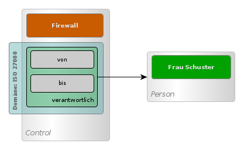

### Domains

The different subject areas that can be processed with the management system veo are called *domains*. At the moment it is planned that 3 domains will be included in veo:

* Data protection
* IT-Grundschutz
* ISO 27000

These 3 domains can be used individually or combined. Users can start with the domain data protection first and create a directory of processing activities there, for example.
Later, it is possible to use the same objects created for this purpose in the IT-Grundschutz domain. Domains can also be copied and extended. Own domains can be created, if necessary derived from the existing ones.

A domain consists of a set of aspects, links, forms and catalogues:

* A domain object contains several groups of properties. These groups are called **aspects** in the object model of veo. An aspect is assigned to one or more domains.
**Links** are links from one object to another object. Just like aspects, links can contain properties that describe this link.
* A **form** can be used to collect exactly the data needed for a specific use case from a domain.
* A **catalog** is a collection of subject objects with aspects from the domain that can be applied to an ISMS model.

#### Aspects

An aspect contains several properties of a subject object. Each aspect is assigned to one or more domains. Taken together, all aspects represent the different perspectives on a subject object.

For example, a process can be a procedure for a directory of processing activities in the domain data protection. Therefore, the process contains aspects with properties from the domain data protection for the directory of processing activities. At the same time, the same process can also be part of a risk analysis in the domain ISO 27000 and for this reason contains an aspect from the domain ISO 27000 with the properties *Confidentiality*, *Integrity* and *Availability*.

#### Links

Links are extended aspects. In addition to properties, links contain a link to another object. A link is a connection to another object with properties that belong to the connection. Just like an aspect, a link belongs to a domain. For example, a link *Responsible* can be defined in a control. This link contains the link to a person and the property *from* and *to*.

#### Object schema

Through the aspects and links, the data that subject object contains in veo is flexible. The structure of the data can be changed. So that it is always clear which data an object contains, the data is described by a schema. The schema is written in the language [JSON Schema](https://json-schema.org/). The schema ensures which data a subject object may contain when reading and writing. Data that is not defined in the schema cannot be written and no data is output that is not defined in the schema.

#### Forms

A domain contains any number of forms. These forms can be used specifically to edit the aspects and links in the objects that are contained in the domain and help users to implement the workflows required in the domain. The forms are only visible to users working with the domain. Users can define new forms in the domain or modify and adapt existing ones. The section [Forms](forms) describes the forms in veo.

#### Catalogues

Each domain contains a catalogue. A catalogue is a collection of subject objects that can be applied to an ISMS model. Each catalogue entry is linked to a subject object that belongs to the catalogue. In addition, a catalogue entry contains a set of rules that determine what actions are performed when a catalogue entry is applied.

The domain Data Protection contains catalogue entries for Technical and Organisational Measures (TOMs). Each of these catalogue entries is associated with a <DocLink to="/object_model/objects#control">Control</DocLink>. There are two rules for application when the catalogue entry is applied to a <DocLink to="/object_model/objects#process">Formulare</DocLink>:

* Copy the control
* Link the control to the process

