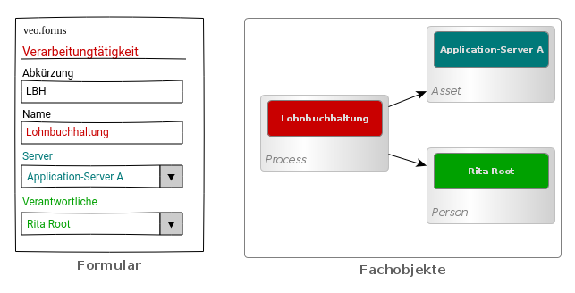
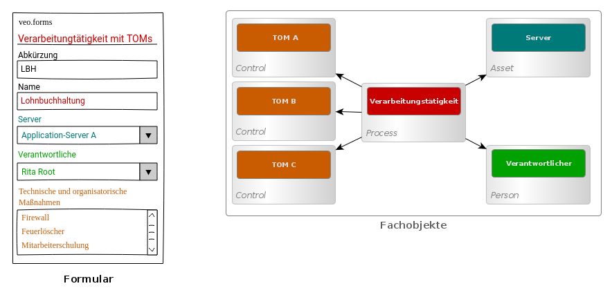

## Formulare

In veo können Formulare definiert werden, mit denen Objekte aus dem Modell erzeugt werden können. Es kann mehrere Formulare für ein Fachobjekt geben. Die Formulare müssen nicht Felder für alle Eigenschaften eines Objekts enthalten. Mit einem Formular können genau die Daten erfasst werden, die für einen Anwendungsfall benötigt werden. Mit einem Formular können auch Links und deren Eingenschaften bearbeitet werden. Die Elemente der Formulare werden in einem Formularschema beschrieben. In dem Schema wird definiert welche Felder angezeigt werden, welche Aspekte damit verändert werden. Außerdem kann konfiguriert werden, welches Formularelement verwendet werden soll. So kann zum Beispiel die Auswahl eines Elements aus einer Liste durch eine Dropdown-Liste oder einen Radio-Button erfolgen. Im Formular-Schema kann auch flexibel konfiguriert werden, wie die Elmente im Formular gruppiert und angeordnet werden.

Ein einfaches Formular für eine Verarbeitungstätigkeit kann zum Beispiel die Daten des Verfahrens selber (modelliert als <DocLink to="/object_model/objects#process">Prozess</DocLink> und zwei Verknüpfungen zu einem Server und einer verantwortlichen Person enthalten.

Wenn zusätzlich auch die Technischen und organisatorischen Maßnahmen (TOMs) erfasst werden sollen, dann kann ein zweites Formular erzeugt werden, das zusätzlich Verknüpfungen zu den TOMS verwalten kann, die als <DocLink to="/object_model/objects#control">Control</DocLink> modelliert werden.

