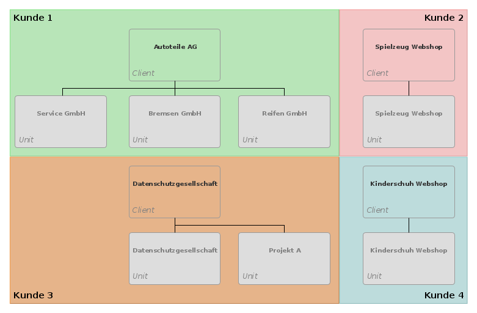
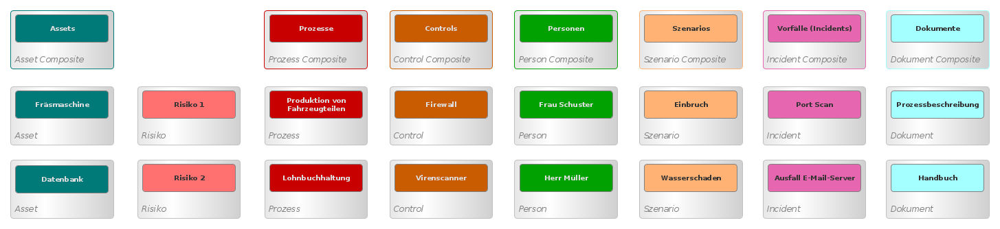
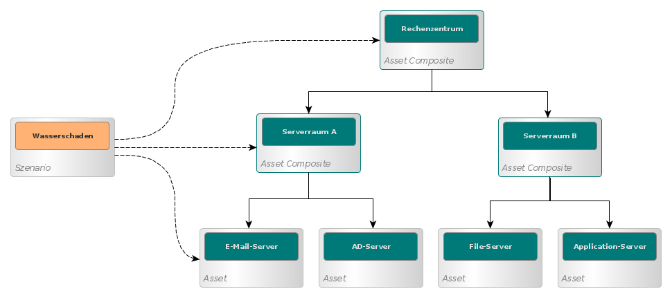
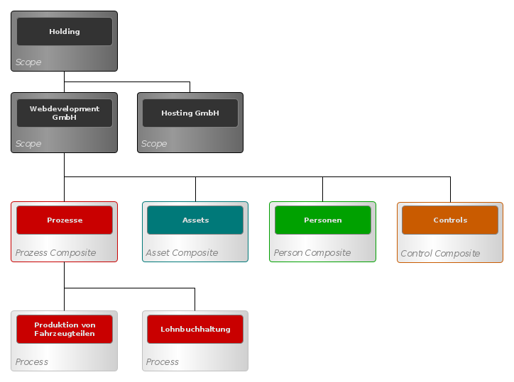
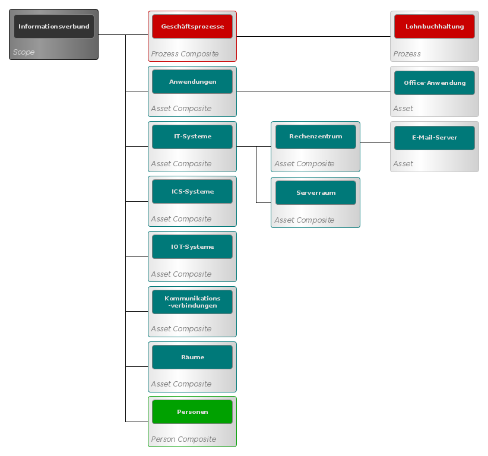

### Organisationsobjekte

Organisationsobjekte helfen bei der Zuordnung der Objekte zu Anwendern. Organisationsobjekte realisieren die Trennung der Daten in unterschiedliche Mandanten. Innerhalb eines Mandanten können weitere Untergruppen angelegt werden, z.B. für Tochtergesellschaften oder Fachabteilungen.

#### Client

Der Client im Objektmodell bildet einen Kunden bzw. ein Mandanten ab. Ein Kunde kann eine Organisation sein, ein Kunde kann aber auch eine einzelne Person sein. Die Daten, die zu einem Client gehören sind von den Daten anderer Clients getrennt und können in keiner Weise mit einander vermischt oder verknüpft werden. Es ist nicht möglich Daten von einem Client zu einem anderen Client zu übertragen. Jedes Objekt in veo gehört zu genau einem Client. Einem Client können mehrere Anwender (Accounts) zugeordnet werden. Ein Anwender kann niemals auf Daten zugreifen, die zu einem Client gehören, dem er nicht zugeordnet ist.

#### Unit

Die Unit teilt einen Mandanten in eine oder mehrere Untereinheiten auf. Eine Unit stellt eine Organisation dar (z.B. ein Unternehmen) oder eine Abteilung in einer Organisation. Die Unit ist der Stammknoten im Objektmodell von veo und die hierarchische Wurzel von Objekten und Gruppen. Eine Unit ist genau einem Client zugeordnet. Es kann beliebig viele Units in einem Client geben. Wenn ein Nutzer mit veo arbeitet, muss zuerst immer eine Unit ausgewählt werden. Alle anderen Objekte und Gruppen sind immer genau einer Unit zugeordnet. Es ist nicht möglich, Objekte in veo zu erstellen, die keiner Unit zugeordnet sind. Die Unit ist ein Organisationsobjekt, das keine fachliche Funktion hat. Wenn eine Unit gelöscht wird, dann werden auch alle in Objekte in der Unit gelöscht.

### Fachobjekte

Für den Betrieb von Managementsystemen für Informationssicherheit und Datenschutz enthält das Objektmodell von veo die Fachobjekte [Prozess](#prozess), [Asset](#asset), [Szenario](#szenario), [Risiko](#risiko), [Control](#control), [Incident](#incident), [Dokument](#dokument) und [Person](#person). Diese Objekte können über sogenannte Subtypen weiter präzisiert werden.

#### Prozess

Ein Geschäftsprozess ist eine Folge von Aktivitäten, die Betriebsmittel verwendet, um Eingaben in Ergebnisse umzuwandeln:

* BSI IT-Grundschutz: "Geschäftsprozess"
* DS-GVO: "Verarbeitungstätigkeit"

#### Asset

Ein Objekt, das einen erkennbaren Wert für ein Unternehmen hat, ein Vermögenswert. Es gibt viele Arten von Assets: Informationen, Software, Server, Menschen und ihre Qualifikationen, Fähigkeiten und Erfahrungen außerdem immaterielle Werte, wie z. B. Ruf und Image.

Assets können andere Assets enthalten (siehe [Composites](#composites)). Systemkomponenten haben häufig einen rekursiven Aufbau:

> NIST SP 800-160 Vol. 1 under system element from ISO/IEC/IEEE 15288
> Component: Member of a set of elements that constitute a system.
> Note 1: A system element can be a discrete component, product, service, subsystem, system, infrastructure, or enterprise.
> Note 2: Each element of the system is implemented to fulfill specified requirements.
> Note 3: The recursive nature of the term allows the term system to apply equally when referring to a discrete component or to a large, complex, geographically distributed system-of-systems.
> Note 4: System elements are implemented by: hardware, software, and firmware that perform operations on data/information; physical structures, devices, and components in the environment of operation; and the people, processes, and procedures for operating, sustaining, and supporting the system elements.

Der Objekttyp "Asset" ist beispielsweise geeignet für die Abbildung der folgenden Typen aus den genannten Standards:

* BSI IT-Grundschutz: Zielobjekte
* ISO 2700x: Assets
* NIST SP 800-61: Component, System, System-of-Interest, Capability

#### Szenario

Eine Situation, die eintreten kann und die Informationssicherheit gefährdet. Beschreibt ein einzelnes Schadensereignis oder einen Satz von Schadensereignissen, die einer spezifischen Bedrohungsquelle zugeordnet werden können.

Der Objekttyp "Szenario" ist beispielsweise geeignet für die Abbildung der folgenden Typen aus den genannten Standards:

* BSI IT-Grundschutz: sowohl "Bedrohung" als auch "Gefährdung" (über Subytypen)
* NIST SP 800-30: sowohl "Threat Event" als auch "Threat Scenario" (über Subtypen)
* ISO 27005: "Incident Scenario", "Threat" (über Subtypen)

#### Risiko

Das Risiko ist ein Maß dafür, inwieweit ein Ereignis oder ein Umstand ein zu erreichendes Ziel beeinflusst. Der Effekt kann auch positiv sein (Chance). Risiko drückt eine Unsicherheit/Unwägbarkeit (ISO 27000: "Uncertainty") aus. Risiko wird in der Anwendung stets über die Zuordnung von Risikoträgern zu Szenarien definiert. Risikoträger können sein: Assets, Prozesse, Scopes.

Das Risiko kann einem Risk Owner zugeordnet werden (ISO/IEC 27000: "a person or entity with the accountability and authority to manage a risk"). In den Begrifflichkeiten des NIST 800-30 entspricht dies dem "Information Owner" (nicht dem "Risk Assessor"). Die Zuordnung eines Risk Owners ist optional.

Ein Risiko kann durch ein Control mitigiert werden. Diese Zuordnung ist optional.

Die Bewertung der Auswirkung und der Wahrscheinlichkeit eines Szenarios kann in die Bewertung des Risikos einfließen. Risiken in der Informationssicherheit können in Verbindung damit stehen, dass eine Schwachstelle von einer Bedrohung ausgenutzt wird und so der Organisation Schaden zufügt.

Der Objekttyp "Risiko" ist beispielsweise geeignet für die Abbildung der folgenden Begriffe aus den genannten Standards:

* BSI IT-Grundschutz: "Risiko"
* NIST SP 800-30: "Risk"

#### Control

Ein Control ist eine Maßnahme, die ein Risiko verändert. Ein Control kann eine Richtlinie, ein Verfahren, eine Leitlinie oder eine Vorgehensweise sein mit administrativer, technischer, managementbezogener oder rechtlicher Natur.

Der Objekttyp Control kann auch eine Gruppe von Controls abbilden (siehe "Composite"). Darüber kann ein Kapitel aus einem Standard mit Maßnahmen abgebildet werden, oder ein "Baustein" aus dem BSI IT-Grundschutz.

Der Objekttyp "Control" ist beispielsweise geeignet für die Abbildung der folgenden Begriffe aus den genannten Standards:

* BSI IT-Grundschutz: "Baustein", "Anforderung" und "Maßnahme" (über Subtypen)
* NIST SP 1800-15B: "Control"
* DS-GVO: "Technische und organisatorische Maßnahmen"

#### Incident

Ein Vorfall bzw. Sicherheitsvorfall (Englisch: Incident) ist ein Ereignis, dass eingetreten ist und möglicherweise die Informationssicherheit gefährdet hat. Ein Incident kann ausgelöst werden durch eine Bedrohung.

Der Objekttyp "Incident" ist beispielsweise geeignet für die Abbildung der folgenden Begriffe aus den genannten Standards:

* BSI IT-Grundschutz: "Sicherheitsvorfall"
* NIST CSF/FIPS 200: "Incident"
* DS-GVO: "Verletzung des Schutzes personenbezogener Daten"

#### Person

Eine Person, Personengruppe oder eine Rolle, die in Beziehung zu den anderen Objekten steht. Jede Person, die als Asset betrachtet wird.

Der Objekttyp "Person" ist beispielsweise geeignet für die Abbildung der folgenden Begriffe aus den genannten Standards:

* NISTIR 7693: "Person"

#### Dokument

Ein Dokument, das eine anderes Objekt beschreibt oder zusätzliche Informationen liefert. Dient der Abbildung von Richtlinien, Leitlinien, Policy-Dokumenten, Vorfallsdokumentation etc. unabhängig von Format, Medium oder Quelle.

Das Document kann sich beziehen auf: das Managementsystem und seine Prozesse, Verfahrensdokumentation (ISO 27001: "Documentation") sowie Aufzeichnungen zu Nachweiszwecken (ISO 27001: "Records").

Der Objekttyp "Document" ist beispielsweise geeignet für die Abbildung der folgenden Begriffe aus den genannten Standards:

* ISO 27001: "Documented information", "Documentation" und "Records" (über Subtypen)

#### Composites

Jedes der Fachobjekte, kann ein einzelnes Objekt oder eine Gruppe von Objekten repräsentieren. Zu diesem Zweck kann jedes Fachobjekt Objekte gleichen Typs enthalten. Wenn ein Fachobjekt solche Teilobjekte enthält, dann ist es als ein zusammengesetztes Objekt (English: Composite) modelliert. Jedes Fachobjekt kann zu jedem Zeitpunkt zu einem Composite gemacht werden, indem man ihm Unterobjekte hinzufügt.

Beispiele dafür sind: Teams, die aus einzelnen Personen bestehen, ein Serverschrank der einzelne Server enthält oder ein Baustein (Control) aus dem IT-Grundschutz, der viele einzelne Maßnahmen enthält. In allen Anwendungsfällen in veo kann ein zusammengesetztes Objekt genauso verwendet werden, wie ein einzelnes Objekt. Für jeden Fall kann individuell entschieden werden, ob es sinnvoller ist die einzelnen Teilobjekte zu betrachten oder das zusammengesetzte Objekt als Ganzes.

Objekte, die Teil eines Composites sind, können als Ganzes oder individuell betrachtet werden. Ein Asset in einer Risikoanalyse kann z.B. ein Rechenzentrum, ein Serverraum oder auch ein einzelner Server sein, die zusammen als das Composite "Rechenzentrum" abgebildet wurden.

Ein Fachobjekt kann in mehreren Composites gleichzeitig enthalten sein. Die Person "Frau Müller" kann z.B. gleichzeitig als Unterobjekt in den Personen-Composite "Vertriebsabteilung" und "Projektteam" sein.

#### Scope

Scopes stellen einen weiteren Gruppierungsmechanismus zur Verfügung. Anders als bei Composites können hier Fachobjekte unterschiedlichen Typs zu einer Gruppe zusammengeführt werden.

* Eine Scope ist (wie jedes andere Fachobjekt) immer genau einer Unit und damit auch einem Client zugeordnet.
* Scopes können beliebige Fachobjekte oder andere Scopes enthalten.
* Ein Fachobjekt kann in mehreren Scopes enthalten sein.
* Wenn ein Scope gelöscht wird, dann werden die enthaltenen Scopes und Fachobjekte nicht gelöscht.

Abgrenzung zu Composites: auf diesen Gruppen sind anders als bei Composites nicht alle Operationen verfügbar, die auf den Fachobjekten operieren. Ein Asset-Composite oder Szenario-Composite kann in Risikoanalysen genauso verwendet werden, wie ein einzelnes Asset. Dies ist bei Scopes nicht der Fall.

Scopes haben eine zentrale Bedeutung bei der Organisation von Daten in veo. Im Gegensatz zu den Units gehören Scopes zu den Fachobjekten, dass heißt sie sind Träger fachlicher Eigenschaften und können in den Anwendungsfällen für Datenschutz und Informationssicherheit verwendet werden. Da Scopes andere Scopes oder Fachobjekte enthalten, können damit viele unterschiedliche organisatorische Einheiten abgebildet werden:

* Organisationen, Teilorganisationen, Tochtergesellschaften
* Abteilungen, Fachbereiche, Teams
* Projekte [PMBOK](https://de.wikipedia.org/wiki/A_Guide_to_the_Project_Management_Body_of_Knowledge), ISO 21500 etc.)
* Informationsverbünde (IT-Grundschutz)
* Zertifizierungs-Scopes (ISO 27001 / ISO 14001 / ISO 9001 ...)
* System-of-Interests (ISO 21839 / ISO 15288)
* System-of-Systems / ein System (s.o.)
* Services (ISO 20000 / ITIL etc.)

Organisationen, Teilorganisationen oder Tochtergesellschaften werden als Scopes modelliert. Eine Teilorganisationen kann andere Scopes enthalten, die dann z.B. Fachbereiche, Abteilungen und Teams abbilden.

Ein Informationsverbund für den IT-Grundschutz des BSI wird als Scope modelliert, der eine Prozess-, mehrere Asset und eine Personengruppe enthält. Die Gruppen mit Fachobjekten können beliebig viele Untergruppen desselben Typs enthalten. Die IT-Grundschutz Fachobjekte Anwendung, IT-, ICS-, IOT-System, Kommunikationsverbindung und Raum werden in veo als Assets modelliert.

